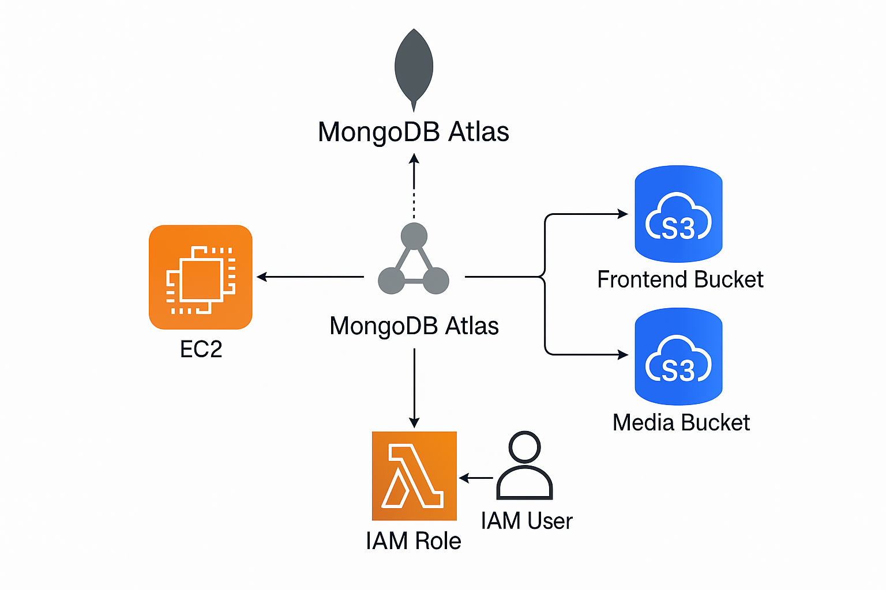

# Blog Application Infrastructure

This repository contains infrastructure as code (IaC) for deploying a MERN (MongoDB, Express, React, Node.js) stack blog application on AWS. The infrastructure is provisioned using Terraform and configured using Ansible.

## Architecture Overview

The application follows a modern cloud architecture with the following components:

- **Backend Server**: EC2 instance running Node.js/Express API
- **Frontend**: Static React SPA hosted on S3 website
- **Database**: MongoDB Atlas (external managed service)
- **Media Storage**: S3 bucket for uploaded media files



## Infrastructure Components

### AWS Resources (Terraform)

- **EC2 Instance**: t3.micro running Ubuntu 22.04 LTS
- **Security Groups**: Allowing SSH, HTTP, and API port (5000)
- **S3 Buckets**:
  - Frontend bucket (static website hosting)
  - Media bucket (file uploads)
- **IAM User**: For programmatic access to S3 buckets

### Application Setup (Ansible)

- **Backend Deployment**: 
  - Node.js via NVM
  - PM2 process manager
  - Environment configuration
- **Frontend Deployment**:
  - Built with pnpm
  - Deployed to S3 website bucket
  - Configured for API endpoint

## Prerequisites

- AWS CLI configured with appropriate credentials
- Terraform (v1.11.4+)
- Ansible (latest version)
- SSH key pair for EC2 access

## Repository Structure

```
.
├── Ansible/
│   ├── ansible.cfg              # Ansible configuration
│   ├── backend-playbook.yml     # Main deployment playbook
│   ├── inventory.ini            # Target servers inventory
│   └── roles/
│       ├── backend/             # Backend deployment role
│       └── frontend/            # Frontend deployment role
└── Terraform/
    ├── init.sh                  # EC2 user data script
    ├── main.tf                  # Main infrastructure definition
    ├── variables.tf             # Variable declarations
    └── terraform.tfstate        # State file (should be remote in production)
```

## Deployment Process

### 1. Infrastructure Provisioning (Terraform)

First, initialize and apply the Terraform configuration:

```bash
cd Terraform
terraform init
terraform apply -var="key_name=firstkey" -var="frontend_bucket=sda1029-front-bucket" -var="media_bucket=sda1029-media-bucket"
```

This will provision:
- EC2 instance for the backend
- S3 buckets for the frontend and media files
- Security groups and IAM resources

The terraform output will provide:
- Backend instance public IP
- Frontend S3 website URL
- S3 access credentials

### 2. Application Deployment (Ansible)

Next, deploy the application using Ansible:

```bash
cd ../Ansible
ansible-playbook backend-playbook.yml
```

This will:
- Install Node.js and PM2 on the EC2 instance
- Clone the application repository from GitHub
- Configure environment variables
- Build and deploy the frontend to S3
- Start the backend API with PM2

## Environment Configuration

The application uses environment variables defined in:

1. **Backend Environment** (`roles/backend/templates/env.j2`):
   - MongoDB connection string
   - AWS credentials for S3 access
   - API configuration

2. **Frontend Environment** (`roles/frontend/templates/env.j2`):
   - API endpoint URL
   - Media bucket URL

## Security Notes

- **AWS Credentials**: The provided AWS access keys should be rotated regularly
- **MongoDB Password**: The MongoDB connection string contains sensitive credentials
- **SSH Key**: The EC2 instance uses an SSH key for access

## Accessing the Application

- **Frontend**: http://sda1029-front-bucket.s3-website.eu-north-1.amazonaws.com
- **Backend API**: http://13.51.200.121:5000/api

## Maintenance

### Backend Updates

To update the backend application:

```bash
cd Ansible
ansible-playbook backend-playbook.yml
```

### Infrastructure Updates

To update the infrastructure:

```bash
cd Terraform
terraform plan  # Review changes
terraform apply # Apply changes
```

### Logs

Backend logs are available on the EC2 instance:

```bash
ssh -i ~/.ssh/firstkey.pem ubuntu@13.51.200.121
pm2 logs blog-backend
```

## Cleanup

To destroy all resources when no longer needed:

```bash
cd Terraform
terraform destroy -var="key_name=firstkey" -var="frontend_bucket=sda1029-front-bucket" -var="media_bucket=sda1029-media-bucket"
```

> **Warning**: This will permanently delete all resources including data in S3 buckets.

## Contributing

Please follow these guidelines when contributing to this infrastructure:

1. Always run `terraform plan` before applying changes
2. Test changes in a development environment first
3. Document any new variables or configurations
4. Update this README as needed

## Troubleshooting

Common issues and solutions:

1. **Backend connectivity issues**:
   - Check security group rules
   - Verify the EC2 instance is running
   - Check PM2 process status

2. **Frontend not updating**:
   - Ensure S3 bucket policy allows public access
   - Check if the frontend build completed successfully
   - Clear browser cache

3. **Database connection errors**:
   - Verify MongoDB Atlas IP whitelist includes the EC2 instance
   - Check connection string in the environment variables

## Future Improvements

- Set up CloudFront for frontend content delivery
- Implement auto-scaling for the backend
- Move to container-based deployment with ECS
- Set up CI/CD pipeline with GitHub Actions
